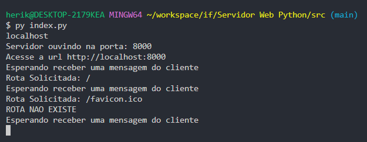
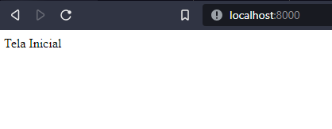
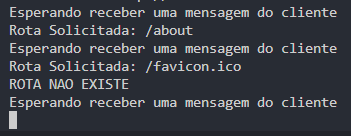
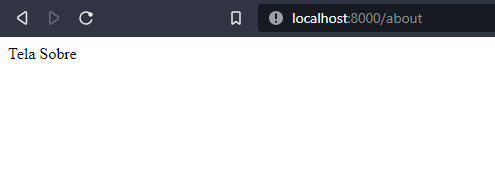

# Servidor Web Python
---
Este servidor é um servidor web básico implementado para aprendizado na disciplina de Redes no curso de Engenharia de Computação no IFMG - Campus Bambuí.
---
## Como Executar
Para executar o servidor, esteja dentro do diretório src e execute o seguinte comando: `python index.py`

## Como Contribuir
Para contribuir com o projeto, crie uma Fork, clone o repositório para a sua máquina e faça as suas alterações localmente. Em seguida, faça os commits para registrar suas alterações e envie-as para o seu ork. No seu Fork do projeto no GitHub, você verá um botão "Compare & pull request". Clique nesse botão para abrir uma nova Pull Request. Preencha os detalhes da solicitação e descreva suas alterações.

# Exemplo de Execução
## Iniciando o servidor e acessando a página "Home", a página inicial.
### Terminal

### Navegador

---
## Acessando a página "About".
### Terminal

### Navegador
